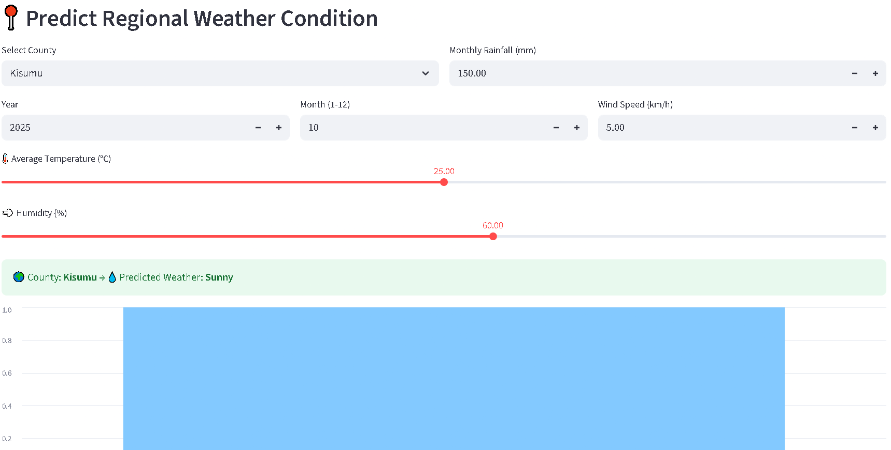
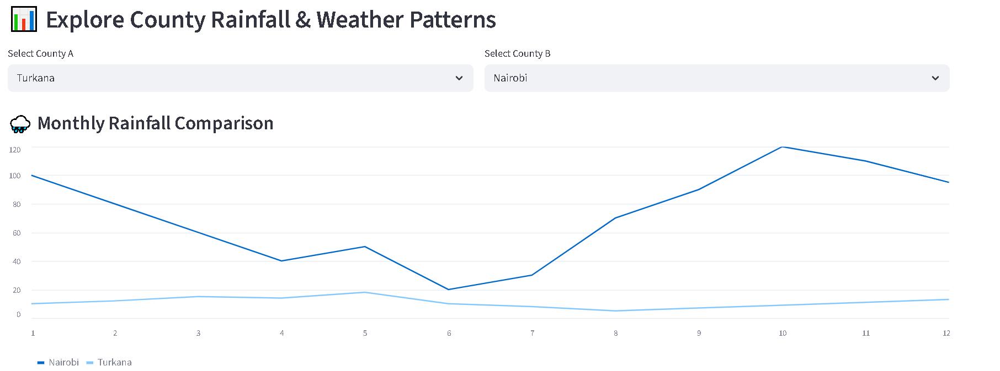
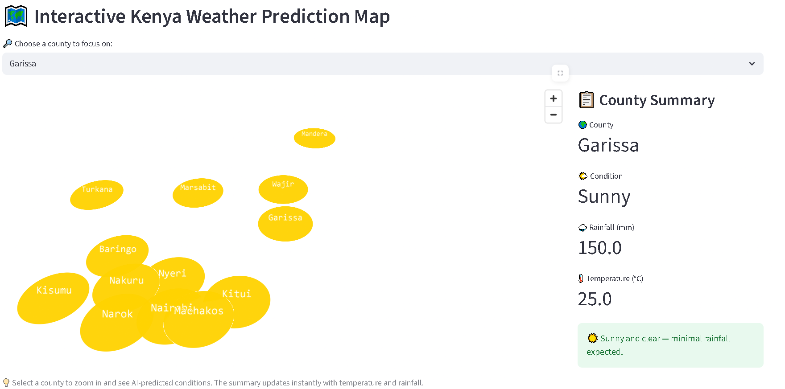

# 🌍 Kenya Water AI — Predicting Rainfall & Weather Patterns

## 📘 Overview
**Kenya Water AI** is a Streamlit-based machine learning app designed to analyze and predict regional rainfall and weather patterns across Kenya.  
This project aligns with **United Nations Sustainable Development Goal (SDG) 6: Clean Water and Sanitation**, aiming to support **sustainable water resource management** through AI-driven insights.  

The app uses key climate features such as **year, month, temperature, humidity, windspeed, and rainfall** to forecast rainfall trends and visualize regional weather changes — promoting data-driven environmental decision-making.

---

## 🚀 Features
- 🌦️ **Rainfall & Weather Prediction** — Predict rainfall levels using trained ML models  
- 🗺️ **Interactive Map** — Visualize rainfall trends and regional patterns across Kenya  
- 📈 **Data Visualization** — Monthly temperature comparisons and humidity trends  
- 🔍 **User Input Interface** — Enter custom data to generate predictions instantly  
- 🧠 **AI-Powered** — Built using TensorFlow for smart and scalable predictions  

---

## 🎯 SDG Alignment
| SDG | Description | Project Contribution |
|-----|--------------|----------------------|
| 🧩 **SDG 6 — Clean Water and Sanitation** | Ensure availability and sustainable management of water and sanitation for all. | Uses AI to predict rainfall patterns and support water management planning in Kenya. |

---

## 🧠 Model Training Notebook (Google Colab)
You can view the full training process and model development steps here:  
👉 [**Open in Google Colab**](https://colab.research.google.com/drive/1S1UE4oiei4vHRchtkEpNXBIzaLuwlIne?usp=sharing)

---

## 💻 App Demo Screenshots

### 🏠 App Home


### 🌧️ Rainfall Prediction


### 📊 Regional Weather Insights


---

## ⚙️ Tech Stack
- **Frontend:** Streamlit  
- **Backend / ML Framework:** TensorFlow, Scikit-learn  
- **Visualization:** Matplotlib, Plotly  
- **Language:** Python  
- **Environment:** Google Colab, VS Code  

---

## 🧩 Folder Structure
olutions for global challenges
kenya_water_ai/
│
├── app.py # Streamlit app
├── scaler.pkl # Scaler used in training
├── requirements.txt # Required dependencies
├── rainfall_data.csv # Dataset used in app
├── images/ # Screenshots for README
│ ├── demo.png
│ ├── demo2.png
│ └── demo3.png
└── README.md


---

## 🧰 Installation & Setup
1. Clone this repository  
   ```bash
   git clone https://github.com/yourusername/kenya_water_ai.git
   cd kenya_water_ai


Create a virtual environment (optional but recommended)

python -m venv venv
venv\Scripts\activate      # On Windows
source venv/bin/activate   # On macOS/Linux


Install dependencies

pip install -r requirements.txt


Run the Streamlit app

streamlit run app.py

🧾 Requirements

Example of a simple requirements.txt:

streamlit
tensorflow-cpu
scikit-learn
pandas
numpy
matplotlib
plotly

🧹 .gitignore

Add this .gitignore to keep your repo clean:

venv/
__pycache__/
*.pkl
*.h5
.DS_Store
*.csv
*.ipynb_checkpoints
.env

🌟 Future Improvements

Add regional drought and flood predictions

Integrate live meteorological API data

Build mobile-friendly UI

✨ Acknowledgements

UN SDGs framework for sustainable development

Streamlit for enabling quick deployment of AI apps

TensorFlow for model training

Kenya Meteorological Data for climate insights

🤝 Contributing

Pull requests and feedback are welcome!
If you'd like to contribute to this project, please fork the repo and submit a PR.

📬 Contact

Author: Hafsa Hajir
📧 Email: [hafsahajir87@gmail.com
]
🔗 GitHub: https://github.com/xafsithoo-sys

## Pitch deck link https://www.canva.com/design/DAG2C0kRkgI/OiL_3ElWsEVTVe-KtPBGWQ/edit?utm_content=DAG2C0kRkgI&utm_campaign=designshare&utm_medium=link2&utm_source=sharebutton


